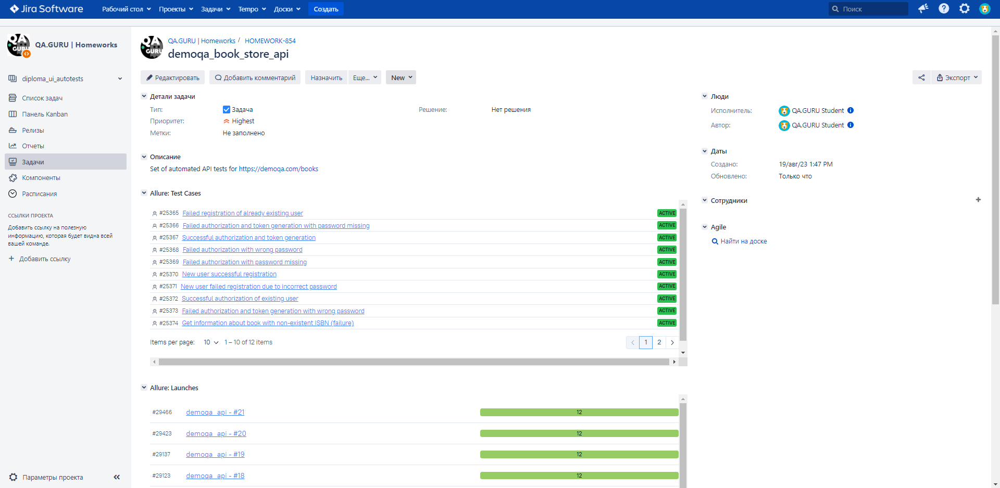

# Демо-проект по автоматизации тестирования API для [](https://demoqa.com/books) Book Store

> [demoqa.com](https://demoqa.com/) - тренировочная платформа для QA-студентов и инженеров.

____

> ## :ballot_box_with_check: <a name="Содержание">**Содержание:**</a>

* <a href="#tools">Технологии и инструменты</a>

* <a href="#cases">Примеры автоматизированных тест-кейсов</a>

* <a href="#jenkins">Сборка в Jenkins</a>

* <a href="#console">Запуск тестов из терминала</a>

* <a href="#allure">Allure отчет</a>

* <a href="#allure-testops">Интеграция с Allure TestOps</a>

* <a href="#jira">Интеграция с Jira</a>

* <a href="#telegram">Уведомление в Telegram с помощью бота</a>

____

<a id="tools"></a>
> ## :ballot_box_with_check: <a name="Технологии и инструменты">**Технологии и инструменты:**</a>

<p  align="center"

<code><a href="https://www.java.com/"></a></code>
<code><a href="https://www.jetbrains.com/idea/"></a></code>
<code><a href="https://gradle.org/"></code></a>
<code><a href="https://junit.org/junit5/"></a></code>
<code><a href="https://rest-assured.io/"></a></code>
<code><a href="https://github.com/"></a></code>
<code><a href="https://github.com/allure-framework"></a></code>
<code><a href="https://qameta.io/"></a></code>
<code><a href="https://www.jenkins.io"></a></code>
<code><a href="https://www.atlassian.com/software/jira"></a></code>
<code><a href="https://web.telegram.org"></a></code>

</p>

- В данном проекте автотесты написаны на <code>Java</code> с использованием
  фреймворков [REST Assured](https://rest-assured.io/) и [JUnit 5](https://junit.org/junit5/).
- Для сборки проекта был использован [Gradle](https://gradle.org/).
- Удаленный запуск реализован в [Jenkins](https://jenkins.autotests.cloud/) с формированием <code>Allure</code>-отчета.
- Подключена отправка уведомлений о результатах запуска сборки в <code>Telegram</code> при помощи бота.
- Осуществлена интеграция с [Allure TestOps](https://allure.autotests.cloud/) и [Jira](https://jira.autotests.cloud/).

____

<a id="cases"></a>
> ## :ballot_box_with_check: <a name="Примеры автоматизированных тест-кейсов">Примеры автоматизированных тест-кейсов:</a>

- Проверка возможности авторизации заранее созданного пользователя с корректными логином и паролем;
- Попытка авторизации с 1) отсутствующим паролем (один логин); 2) неправильным паролем;
- Проверка возможности авторизации с генерацией токена заранее созданного пользователя с корректными логином и паролем;
- Попытка авторизации с генерацией токена с 1) отсутствующим паролем (один логин); 2) неправильным паролем;
- Проверка возможности регистрации с корректными данными;
- Попытка регистрации с 1) недопустимым паролем; 2) логином и паролем уже существующего пользователя;
- Проверка возможности получить подробную информацию обо всех книгах в магазине;
- Парсинг всей информации об одной выбранной книге;
- Попытка получить информацию о книге с несуществующим в магазине ISBN.

  ____

<a id="jenkins"></a>
> ##  Сборка в [Jenkins](https://jenkins.autotests.cloud/job/demoqa_api/)

Для запуска сборки необходимо перейти в раздел <code>Собрать с параметрами</code> и нажать кнопку <code>Собрать</code>.

<p align="center">

</p>

После выполнения сборки в блоке <code>История сборок</code> напротив номера сборки появляются значки <code>Allure
Report</code> и <code>Allure TestOps</code>, при клике на которые открываются страницы со сформированным html-отчетом и
тестовой документацией соответственно.
____

<a id="console"></a>
> ## :ballot_box_with_check: <a name="Запуск тестов из терминала">**Запуск тестов из терминала:**</a>

### Команда для терминала IDE для локального запуска тестов:

```
gradle clean test
```

____

<a id="allure"></a>
> ## </a> <a name="Allure"></a>Allure [Report](https://jenkins.autotests.cloud/job/demoqa_api/7/allure/)</a>

### Основная страница отчёта

<p align="center">  
  
</p>  

### Тест-кейсы

<p align="center">  
  


</p>

### Графики

<p align="center">  


  
</p>

____

<a id="allure-testops"></a>
> ##  </a>Интеграция с <a target="_blank" href="https://allure.autotests.cloud/launch/28938">Allure TestOps</a>

Выполнена интеграция сборки <code>Jenkins</code> с <code>Allure TestOps</code>.
Результат выполнения автотестов отображается в <code>Allure TestOps</code>
На Dashboard в <code>Allure TestOps</code> отображена статистика пройденных тестов.

## Allure TestOps Dashboard

<p align="center">  

</p>  

## Тест-кейсы

<p align="center">  
  

  
</p>

____

<a id="jira"></a>

> ##  </a> Интеграция с <a target="_blank" href="https://jira.autotests.cloud/browse/HOMEWORK-854">Jira</a>

<p align="center">  
  
</p>

____

<a id="telegram"></a>

##  Уведомления в Telegram с помощью бота

После завершения сборки созданный в <code>Telegram</code> бот автоматически обрабатывает результаты и отправляет
уведомление со ссылкой на отчет.

<p align="center">

</p>

____

